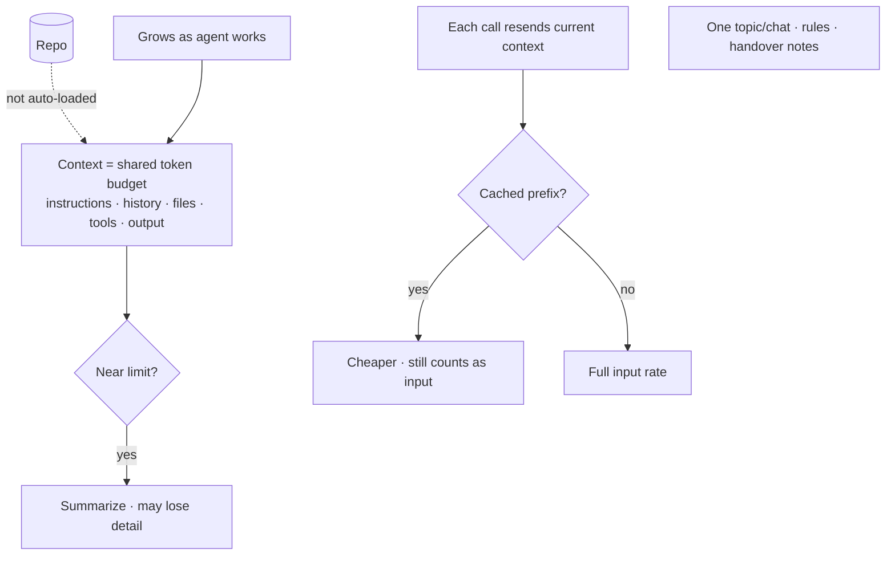

```mermaid
flowchart TB
  W["Context = shared token budget<br/>instructions · history · files · tools · output"]

  Repo[(Repo)] -.->|"not auto-loaded"| W
  Grow[Grows as agent works] --> W
  W --> Full{Near limit?} -->|yes| Sum[Summarize · may lose detail]

  Call["Each call resends current context"] --> Cache{Cached prefix?}
  Cache -->|yes| Cheap[Cheaper · still counts as input]
  Cache -->|no| Pay[Full input rate]

  Tip[One topic/chat · rules · handover notes]
```
